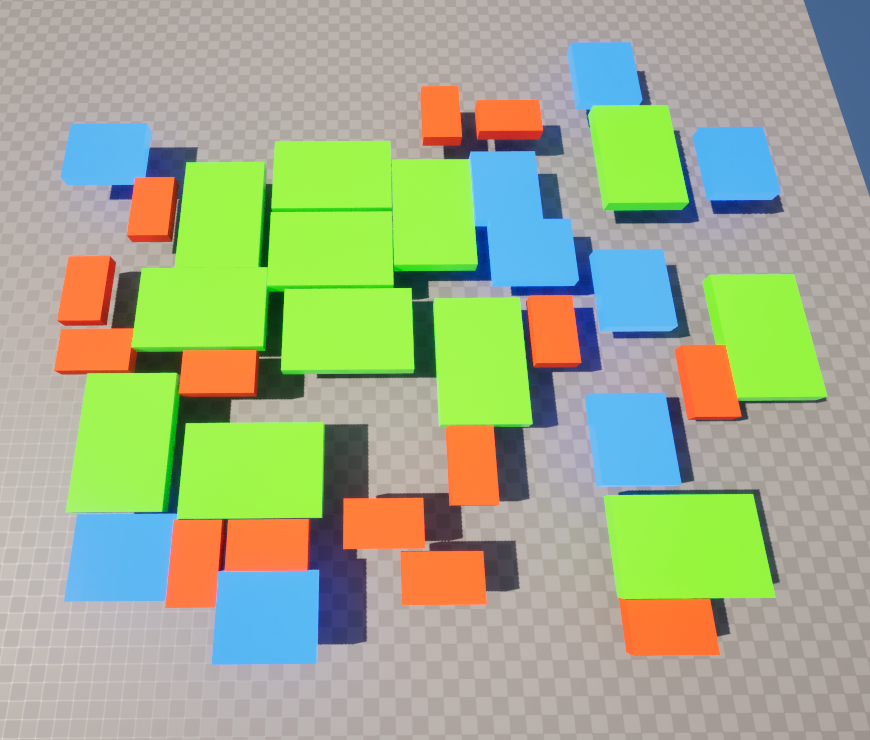
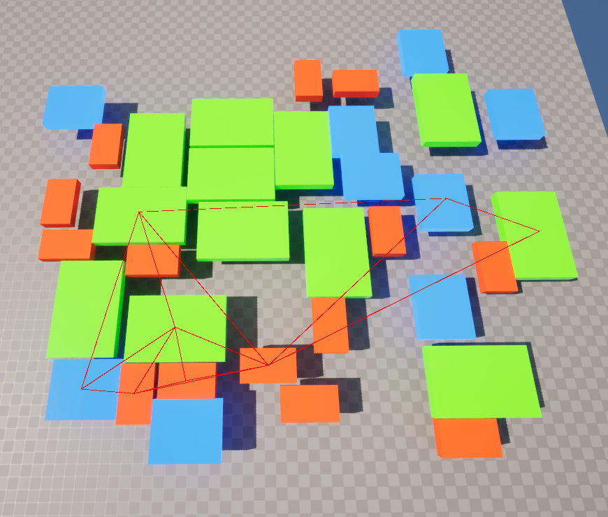
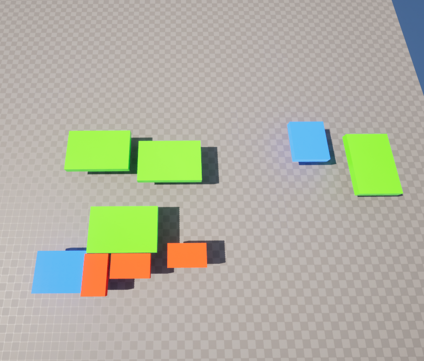
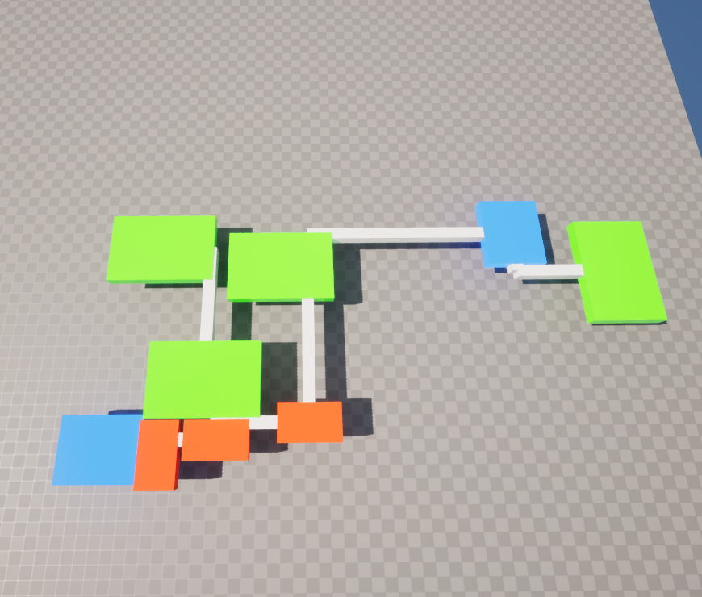

# Procedural Dungeon Generator

A robust and flexible procedural dungeon generation system built in Unreal Engine that creates unique, interconnected room layouts using physics simulation and advanced geometric algorithms.

## Features

- **Physics-Based Room Layout**: Uses physics simulation for natural room placement and overlap resolution
- **Procedural Corridor Generation**: Creates L-shaped corridors connecting rooms using Delaunay triangulation and minimum spanning trees
- **Customizable Generation**: 
  - Configurable room types and corridor styles
  - Adjustable dungeon bounds and room count
  - Seed-based generation for reproducible results
- **Debug Visualization**: Optional visual debugging for triangulation, minimum spanning tree, and corridor layout

## Technical Implementation

The generator uses a multi-stage process to create dungeons:

1. **Room Placement**
   - Spawns rooms with random positions and rotations
   - Uses physics simulation to resolve overlaps
   - Ensures at least one of each room type is spawned

2. **Room Connection**
   - Creates Delaunay triangulation of room positions
   - Generates minimum spanning tree to determine essential connections
   - Converts connections into L-shaped corridor paths

3. **Corridor Creation**
   - Spawns and scales corridor actors along calculated paths
   - Removes disconnected rooms
   - Adjusts final room collision settings

## Usage

### Basic Generation

```cpp
bool GenerateDungeon(
    int Seed,                                    // Random seed for reproducible generation
    TArray<TSubclassOf<ARoomBase>> RoomClasses, // Array of room types
    int RoomSpawned,                            // Number of rooms to generate
    TArray<TSubclassOf<ACorridorBase>> CorridorClasses, // Array of corridor types
    FVector DungeonPosition,                    // Center position of dungeon
    FVector2D DungeonMinBounds,                // Minimum X,Y bounds for room placement
    bool DrawBounds,                           // Debug: Draw dungeon bounds
    bool DrawTriangulation,                    // Debug: Draw Delaunay triangulation
    bool DrawMST,                              // Debug: Draw minimum spanning tree
    bool DrawCorridorLines                     // Debug: Draw corridor paths
);
```

### Example Blueprint Usage

1. Create references to your room and corridor classes
2. Call `GenerateDungeon` from the Dungeon Subsystem
3. Access generated rooms and corridors using `GetRooms()` and `GetCorridors()`

### Included

- 1 Gamemode that calls the GenerateDungeon function
- 3 Types of room blueprints
- 1 Type of corridor blueprint

## Key Components

### DungeonSubsystem
- Main generation orchestrator
- Handles room spawning and corridor creation
- Manages debug visualization

### Triangulation
- Implements Bowyer-Watson algorithm for Delaunay triangulation
- Creates optimal room connections
- Handles degenerate cases and edge conditions

### MinSpanTree
- Implements Kruskal's algorithm for minimum spanning tree
- Ensures efficient room connectivity
- Eliminates redundant connections

## Architecture

The system is built using several key classes:

- `UDungeonSubsystem`: Core generation system
- `ARoomBase`: Base class for room actors
- `ACorridorBase`: Base class for corridor actors
- `UTriangulation`: Triangulation utility class
- `UMinSpanTree`: Minimum spanning tree utility class

## Debug Options

Enable various debug visualizations to understand the generation process:

- Red box: Dungeon bounds
- Red lines: Delaunay triangulation
- Green lines: Minimum spanning tree
- Blue lines: Final corridor paths

## Requirements

- Unreal Engine 5.4 or later
- Physics simulation enabled in project
- Room and corridor classes derived from RoomBase and CorridorBase respectively

## Best Practices

   - Use appropriate dungeon bounds for your room sizes
   - Provide sufficient room types for variety
   - Test different seeds for desired layouts

## Known Limitations

- Physics simulation may take longer with many rooms
- Room placement is semi-random and may require multiple attempts
- L-shaped corridors may not always be optimal for all layouts

## License

This project is intended for learning purposes and is free for personal and educational use.

## Visualization

The following images show the dungeon generator in action.

Step 1 : Spawn randomly and let the physics simulation move the rooms.


Step 2 : Remove any overlapping rooms.


Step 3 : Select main rooms and use the Delaunay triangulation.


Step 4 : Make a minimum spanning tree with the triangulation.


Step 5 : Generate L shaped connections.


Step 6 : Remove any rooms that do not touch the connections.


Step 7 : Spawn corridors to connect rooms.
